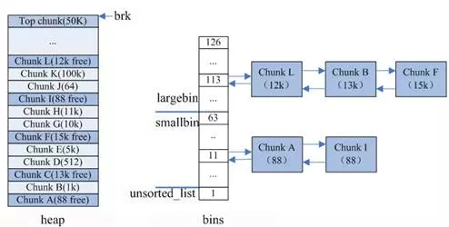

# 虚拟内存
虚拟内存是对主存的抽象，它为每个进程提供了一个大的，一致的和私有的地址空间  
1. 它将主存看成是磁盘的高速缓存，在主存中只保存活动区域，并根据需要在磁盘和主存中来回传送数据，高效的使用了主存  
2. 它为每个进程提供了一致的地址空间，从而简化了内存管理  
3. 它保护了每个进程的地址空间不被其他进程破坏   
32位系统，就是2^32大小的虚拟地址空间  

# linux是几级页表？
逻辑地址--（段表）->线性地址--（页表）->物理地址  
linux使用三级页表  
 

# 内存映射  
linux通过将一个虚拟内存区域与一个磁盘上的对象关联起来，以初始化这个虚拟内存区域的内容，这个过程称为内存映射  

# copy-on-write写时复制

# mmap  
void *mmap（void *start， size_t len， int prot， int flag， int fd, off_t off)  
mmap要求内核创建一个新的虚拟内存区域，并将文件描述符fd指定的对象的一个连续的篇映射到这个新的区域  
prot指明映射区的访问权限：PROT_READ  PROT_WRITE PROT_EXEC  PROT_NONE  
flag:
MAP_ANON  被映射对象是一个匿名对象（匿名文件由内核创建，包含的全是二进制0。CPU第一次引用这样一个区域内的虚拟页面时内核就在物理内存中找到一个合适的牺牲页面，如果该页面被修改过，就将这个页面换出来，用二进制0覆盖牺牲页面并更新页表，将这个页面标记为驻留在内存中的）  
MAP_PRIVAET  被映射的对象是私有的，写时复制的对象。私有映射，不修改被映射的文件  
MAP_SHARED  被映射的对象是共享对象。对内存的修改都会修改磁盘上的映射文件，当然修改不会立即写回文件，何时写回由内核决定      

# shmget
XSI的共享存储与内存映射的不同之处在于，XSI共享存储段是物理内存的匿名段，没有相关的磁盘文件  

# malloc的实现原理  
采用内存池的原因：  
1. brk/sbrk（修改堆的上边界brk）/mmap（用匿名映射） 属于系统调用，如果每次申请内存，都调用这三个函数之一，那么每次都要产生系统调用开销  
2. 这样申请的内存容易产生碎片，因为堆是从低地址到高地址的，如果低地址的内存没有被释放，高地址的内存就不能被回收  

## glibc里malloc的实现
1. 分配内存 < 默认mmap阈值（默认128K），从内存池获取，失败的话走brk系统调用  
2. 分配内存 > 默认mmap阈值， 直接调用mmap系统调用  
  
内存池保存在bins这个长128的数组中，每个元素都是一个双向链表  
bins[0]目前没有使用  
bins[1]称为unsorted_list， 用于维护free释放的chunk  
bins[2, 63) small_bins 用于维护 < 512字节的内存块，每个bin的链表中的chunk大小相同，为index*8  
bins[64, 127) large_bins, 用于维护 > 512 字节的内存块，每个bin的链表中的chunk大小不同。如下标64的chunk大小介于[512, 512+64), 下标95的chunk大小介于[2K+1, 2k+512), 链表上的chunk从小到大的顺序排序  

在内存池中寻找合适的chunk，采用最佳适应的算法：  
1. 如果 < 512字节， 

# free  
1. malloc使用mmap分配的内存，free会调用munmap系统调用马上还给OS，实现真正释放  
2. 堆内的内存，只能释放堆顶的空间，同时堆顶总连续空间大于128K才使用sbrk（-size）回收内存
真正还给OS  
3. 堆内的空闲空间是不会归还给OS的  

# 分段和分页
分页：虚拟内存使每个程序有自己的地址空间，这个空间被分割成多个块，每个块被称作一页或者页面。每一页有连续的地址范围。这些也被映射到物理内存，但并不是所有页都必须在内存中才能运行程序。页的长度是固定的。
【将虚拟地址空间分为若干大小相等的片，称为页
物理地址空间划分为与页大小相等的若干存储块，称为页框  
】

分段：虚拟地址空间被分为代码段、数据段、堆、共享内存映射区域、栈等段。每个段可以是是不同的大小，并且段的长度在运行期间可以动态改变。  

# 缺页异常处理  
DRAM缓存不命中称为缺页  
假设MMU翻译某个虚拟地址A时，触发了一个缺页，控制转移到内核的缺页处理程序，流程为：  
1. 检查虚拟地址A是否合法，通过检查区域的vm_start和vm_end做比较。若不合法，抛出段错误  
2. 检查进程是否有读写或者执行这个区域内的权限  
3. 选择一个牺牲页面，如果这个页面被修改过，就将它交换出去。换入新的页面并更新页表。
当缺页处理程序返回时，CPU重新启动引起缺页的指令，MMU再次翻译A。  

# 页面置换算法
在发生缺页中断时，操作系统需要选择一个页面换出内存，以便给要换入内存的页面腾地方。问题是应该选择哪个页面换出？可以换出别的进程的页面吗？还是只可以换本进程的？  

## 最近未使用页面置换算法 NRU（Not Recently Used）  
每个页面有一个R（read）位，和一个M(write)位。定期（如每次时钟中断时）对R位清零，不对M位清零。因为换出时需要M位指示需不需要写回磁盘，还是简单的覆盖就好了。那么就有四类：
第0类： R位为0（没有被访问），W位为0（未被修改）
第1类： R 0 ，W 1  
第2类： R 1， W 0  
第3类： R 1， W 1  
该算法随机从类编号最小的非空页面集中挑选一个页面淘汰。  
## 先进先出页面置换算法  
## 第二次机会页面置换算法  
在先进先出基础上加上R位，检查最老的页面的R位，如果R位为0，淘汰这个页面。如果R位为1，修改它的装入时间使得它像刚装入一样，并且R位置为0。将这个页面放在链表的尾端，继续搜索下一个页面。      
## 时钟页面置换算法  
改进了第二次机会算法，使得页面不再是一个按照载入时间的单向链表，而是一个环形链表。这样就不用在链表中移动页面。  
## 最近最少使用页面置换算法 LRU   
1. 新数据插入到链表头部；
2. 每当缓存命中（即缓存数据被访问），则将数据移到链表头部；
3. 当链表满的时候，将链表尾部的数据丢弃。  
支持以下操作：get 和 put。 get(key) - 如果 key 存在于缓存中，则获取 key 的 value（总是正数），否则返回 -1。 写入数据 put(key, value) - 如果key不存在，则写入其数据值。当缓存容量达到上限时，它应该在写入新数据之前删除最近最少使用的数据值，从而为新的数据值留出空间。【leetcode146】  
哈希表 + 双向链表

## LFU（Least Frequently Used）最近最少使用算法
它是基于“如果一个数据在最近一段时间内使用次数很少，那么在将来一段时间内被使用的可能性也很小”的思路。  
注意LFU和LRU算法的不同之处，LRU的淘汰规则是基于访问时间，而LFU是基于访问次数的。

# 碎片  
## 内部碎片
已分配块比有效载荷大  

## 外部碎片  
空闲内存合计起来足够满足一个分配请求，但是没有一个单独的空闲块足够大可以处理这个请求  

# 内存对齐的作用  

# malloc、calloc、realloc、alloca
malloc：申请指定字节数的内存。申请到的内存中的初始值不确定。  
calloc：为指定长度的对象，分配能容纳其指定个数的内存。申请到的内存的每一位（bit）都初始化为 0。  
realloc：更改以前分配的内存长度（增加或减少）。当增加长度时，可能需将以前分配区的内容移到另一个足够大的区域，而新增区域内的初始值则不确定。  
alloca：在栈上申请内存。程序在出栈的时候，会自动释放内存。但是需要注意的是，alloca 不具可移植性, 而且在没有传统堆栈的机器上很难实现。alloca 不宜使用在必须广泛移植的程序中。C99 中支持变长数组 (VLA)，可以用来替代 alloca。  

# 内存屏障/栅栏  
  

# 怎么检查内存错误  

