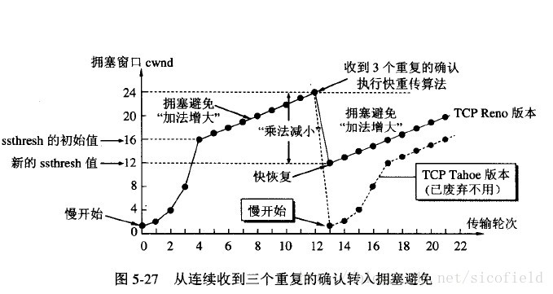

 # tcp 面向连接 可靠 全双工 字节流  
## 面向连接：TCP的两个应用程序必须在它们交换数据之前，通过相互联系来建立一个TCP连接。
建立连接：三次握手  
### 为什么不是两次握手  
TCP需要序列号确保可靠性，三次握手的过程实际上是双方通告序列号。假设只有两次握手，服务器收到了客户端的SYN，可以确认客户端发送的数据是不是应该接受的。但是客户端可能收不到服务器的SYN，就不知道服务器的序列号。  
服务器可能收到旧的连接请求，此时客户端并没有打开连接，服务器以为连接建立好了，实际却没有客户端给他发数据，空等。
拆除连接：四次挥手  
## TIME_WAIT  
2MSL(让上一个连接的分组及其应答消失)  

## 可靠：  
1. 重传：处理分组丢失，重发分组。ACK丢了和分组丢了，区分不出来这两种情况。都是重传。  
超时重传：  
快速重传：重复ACK到达发送方，表明先前的某个分组已经丢失。TCP发送端在观测到至少dupthresh个重复ACK后，即重传可能丢失的数据分组，而不必等到重传计时器超时。不采用SACK时，在收到有效aCK前，至多重传一个报文段。采用SACK，ACK可包含额外信息，使得发送端在每个RTT时间内可以填补多个空缺  
带选择确认的重传（SACK）：  
2. ACK确认：接收方给发送方发送ACK，确定自己已经接受到一个分组。TCP使用的ACK是累计的，一个指示字节N的ACK，暗示所有直到N的字节（但不包括N）都已经接受。这样对ACK提供了一定的鲁棒性，可能后面的ACK足以确认前面丢失的ACK。  
3. 序列号：解决收到重复分组的问题，如果接收方已经见过这个序列号，简单的丢弃这个分组。实际代表了这个分组里的第一个字节在字节流中的偏移量，而不是分组号。这允许分组可变大小，以及重新组包。也可以记录乱序到达的分组。  序列号回绕问题：序列号是32位的，当超过32位的表示范围，又会从零开始。事实上，在1Gbps的网络中，全速率发的话，32秒就会回绕一次。小于MSL（一般是30秒或2分钟）。
4. 端到端的校验和：处理差错的手段之一，检测传输过程中比特错误。  
## 字节流  
TCP不会自动的插入消息边界，比如发送方第一次写入10个字节，第二次写入20个字节，第三次写入50个字节。接收方肯能以20个字节分四次读入这80个字节或者其他的方式。连那个端点独立的选择自己写入和读入大小。
【而UDP，通常应用程序每次写入就产生一个UDP数据包，数据包大小就是写入的字节数加上头部】  
## 滑动窗口  
停等协议（发送一个分组，等到收到这个分组的ACK才能再发送下一个分组）效率太低，引入窗口使得一次可以发送多个分组。  
窗口：在发送方是已经发送但是还没有得到确认的分组的集合，在接收方是下一步期望收到的分组的集合。  
## 流量控制：当接收方跟不上时强迫发送方慢下来  
1. 基于速率的流量控制：  
给发送方规定一个发送速率，发送方不能超过这个速率。适用于流应用程序，可被用于广播和组播发现。  
2. 基于窗口的流量控制：【TCP使用窗口大小字段来通告一个窗口大小，窗口大小是字节数】    
接收方通知发送方使用多大窗口（窗口通告）  
## Nagle算法：解决大量小包网络传输代价高的问题  
当一个TCP连接中有在传数据（已发送还未收到ACK），小的报文段就不能被发送。并且所有在传数据都收到ACK后，这些小数据会被整合到一个大的分组中发送。  
优点：  
实现了自时钟控制，ACK返回越快，数据传输越快。  
减少网络中微型包（加重拥塞）的数目  
缺点：  
和延时ACK结合，可能导致短暂的死锁，直到延时ACK超时。
增大时延  
## 糊涂窗口综合征  
窗口缩小到愚蠢的值，每个分组中有用的数据相对头部的比例很小，因此耗费的资源很多，传输的效率也很低。

## 拥塞控制： 涉及发送方减低速度以不至于压垮其与接收方之间的网络  
拥塞：路由器无法处理高速率流量而被迫丢弃数据   
发送端实际窗口W = min（接收方通知窗口awnd， 拥塞窗口cwnd） 
数据包守恒： 
ACK时钟：由一个ACK到达（ACK时钟）触发一个新数据包传输的关系称为自同步。  
## 慢启动  
在一个新的TCP连接建立或重传计时器检测到丢包，需要执行慢启动  
【以分组为单位】一开始cwnd为1，接收到一个分组的ACK后，cwnd的值增长到2，接着会发送两个分组。如果成功接收到相应的新的ACK，cwnd会由2变成4，以此类推cwnd随着RTT指数增加。  
实际上以字节为单位，初始是SMSS（最大段大小MSS和最大传输单元MTU的较小值），当收到一个ACK，窗口增大min（N，SMSS）大小，N是这个ACK可以确认的收到的字节数。还是指数增加。  
注意当发生ACK延时，每隔一个数据包收到一个ACK，还是指数增加，只是增幅较小  
这样最终cwnd会增至很大，大量的数据包的发送将导致网络瘫痪，此时cwnd将减至原值的一半。   
优点：防止一个新连接给网络带来很大的突发流量，影响其他连接    
## 拥塞避免  
当cwnd的值超过慢启动阈值（ssthresh），就会进入拥塞避免阶段。每收到一个ACK，cwnd增长（1/k)SMSS（整个窗口分成k段发送）【相当于成功发送整个窗口cwnd值才增加一个SMSS】  
发送窗口随时间近似成线性增长  
  
  
当cwnd < ssthresh, 使用慢启动算法  
当cwnd > ssthresh，使用拥塞避免算法  
当cwnd == ssthresh，任何一种算法都可以使用  
ssthresh不是固定的，而是随时间改变。目的是记录TCP最优窗口估计值的下界。  
当有重传时，无论是超时重传还是快速重传 ssthresh = max（在外数据值/2, 2*SMSS)(将ssthresh设为在外数据值的一半也可能增大ssthresh)  

## 快速恢复  
还是数据包守恒的原理，收到一个重复的ACK，说明有一个分组离开了网络，那么cwnd可以加1SMSS  
考虑到如果网络出现拥塞的话就不会收到好几个重复的确认，所以发送方现在认为网络可能没有出现拥塞。所以此时不执行慢开始算法
当收到三个重复ACK（或其他表明需要快速重传的信号）：  
ssthresh = max（在外数据值/2, 2*SMSS)
启动快速重传，将cwnd设为ssthresh + 3*SMSS 
每接收一个重复ACK，cwnd暂时加1SMSS  
每接收到一个好的ACK，将cwnd重设为ssthresh，重新进入拥塞避免阶段
【重复ACK欺骗攻击】

## RST  
发送缓冲区内的的数据会被丢弃立即断开连接。接收端收到RST包后，也不必发送ACK包来确认   
产生RST的情况：  
1. 针对不存在端口的连接请求  
2. 半开连接：建立连接后，服务器宕机重启。客户端不知道连接的另一端已经崩溃了，在这个连接上发送数此时因为服务器重启过不记得这个连接了，就会给客户端发RST  
3. 当**接收缓冲区**内的数据没被应用程序接收，调用close（）产生的不是FIN，而是RST。接收和发送缓冲区内的数据都会被丢弃。
4. 当对方调用了close（），此时再给对方发数据就会收到RST  
5. SO_LINGER 应用强制使用rst关闭  
# udp  不可靠  数据报 保留消息边界  
不提供差错检测、队列管理、流量控制和拥塞控制  

# TCP相关的时延  
TCP连接建立握手  
TCP慢启动拥塞控制  
用于捎带确认的TCP延迟确认算法  
数据聚集的Nagle算法  
TIME_WAIT时延和端口耗尽  

# SYN Flood  

# 三次握手的状态  

# 四次挥手的状态  

# 报文格式
## TCP报头  
基本TCP报文共20字节   
源端口（2字节） 目的端口（2字节）   
序列号（4字节）   
确认号（4字节）  
头部长度（4位）保留（4位）标志位（CWR、ECE、URG、ACK、PSH、RST、SYN、FIN 1字节） 窗口大小（2字节）  
TCP校验和（2字节） 紧急指针(2字节)

## UDP报头  

## IP报头 
IPv4为20字节，不带选项   
版本（4位） IHL（4位） DS字段（6位） ECN（2位） 总长度（16位）  
标识（16位）  标志（3位）  分片偏移（13位）  
生存期（TTL 8位） 协议（8位）  头部校验和（16位）  
源IP地址（32位）  
目的IP地址（32位）   
选项（任意，可变长度，最多40字节）  
IP数据（任意，可变长度，最多65515字节）  

版本： IPv4 为4，IPv6为6  
IHL(Internet头部字段)：IPv4头部长度，6位所以最大值是15，长度最长15*4=60字节（基本头部20字节+选项40字节）不带选项是IHL为5  
DS字段：区分服务字段    
ECN：显示拥塞通知  
总长度：数据报的总长度，以字节为单位。通过这个字段和IHL字段，我们知道数据报的数据部分从哪里开始，以及它的长度  
标识：为了避免将一个数据报分片和其他数据报分片混淆。发送主机通常在每次发送数据报时都将一个内部计数器加1，并复制到标识字段。这对分片很重要   
标志：
协议：包含一个数字，标识数据报有效载荷部分的数据类型。常用17（UDP），6（TCP）。这提供了多路分解的功能，以便IP协议可用于携带多种协议   
头部校验和：仅计算头部，不验证载荷。TTL减一，头部校验和也要改变  

IPv6为40字节   
版本（4位） DS字段（6位） ECN（2位）  流标签（20位）  
负载长度（16位） 下一头部（8位） 跳数限制（8位）  
源IP地址（128位）  
目的IP地址（128位）

IPv6头部大小固定40字节，没有选项。但是有下一头部，形成一条包括特殊扩展或处理指令的头部链  

# IPv4和IPv6的区别  

